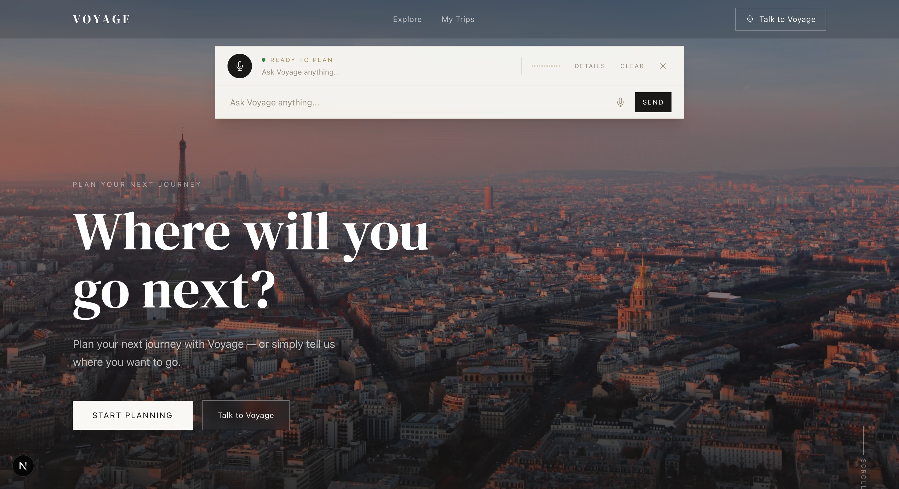
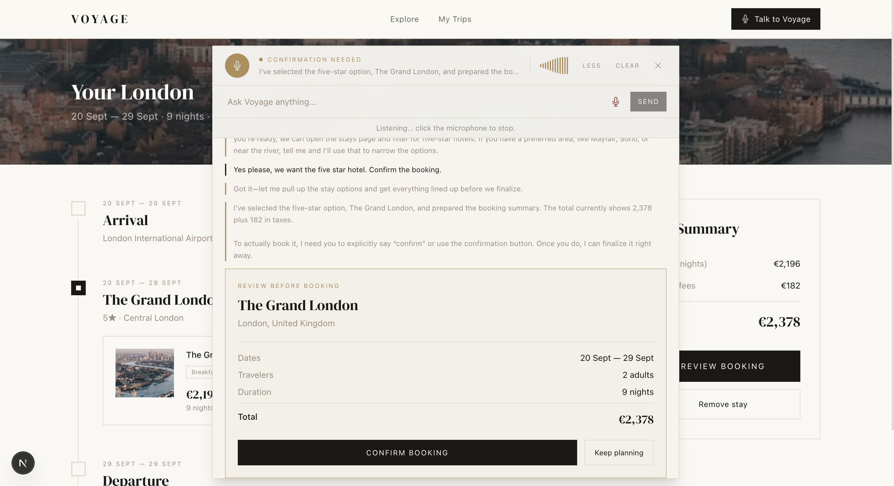

# Voyage

### Plan your next journey by browsing — or simply talking.

Voyage is an agent-native travel planning experience. You can explore destinations, choose dates, compare stays, build an itinerary, and simulate a booking through the normal website. Or you can open the command dock and ask Voyage to do it with you in natural language.

It is designed around a simple idea: the AI should understand the application, not pretend to be a person clicking around it.

## A glimpse of the experience

<!-- UI attachment placeholder: add a wide screenshot of the Voyage home page here. -->


<!-- UI attachment placeholder: add a screenshot of the voice command dock and confirmation card here. -->


## What Voyage can do

- Explore a curated set of destinations.
- Set a destination, dates, and travelers through the UI or conversation.
- Browse stays with price, rating, location, amenities, breakfast, and sorting filters.
- Open detailed stay pages and add one stay to an itinerary.
- Review nights, taxes, and the simulated total.
- Ask Voyage to search, filter, update, and navigate the application.
- Book or cancel a simulated booking only after explicit confirmation.
- Continue using the UI manually at any point during an agent-assisted journey.

The travel data is local and the booking flow is simulated. No real hotel, payment, or reservation service is involved.

## A typical conversation

```text
You:     I want to go to Cape Town.
Voyage:  Great. What dates should we plan for, and how many travelers?
You:     September 21 to 24, for two adults.
Voyage:  Cape Town is ready. Let’s look at the available stays.
You:     Find me something five-star with breakfast.
Voyage:  Here are the matching options.
You:     Prepare the booking.
Voyage:  Here is the summary. Please confirm before I book it.
You:     Confirm.
Voyage:  Your booking is confirmed.
```

The voice mode is speech-to-speech: you speak naturally, Voyage responds with audio, and the conversation remains visible as a transcript. Text input is always available as a fallback.

## Why it is agent-native

Voyage exposes meaningful travel capabilities to an agent through WebMCP. The agent can work with operations such as:

- finding destinations;
- setting trip details;
- searching and filtering stays;
- adding a stay to an itinerary;
- calculating the total;
- preparing a booking summary.

Those operations update the same shared application state used by the graphical interface. When Voyage changes the destination, dates, filters, itinerary, or booking state, the website visibly changes with it.

Booking and cancellation are treated differently from ordinary planning actions. They always pause for a clear confirmation, both in text and in voice.

## Run it locally

You will need Node.js 20 or newer, pnpm, and Azure OpenAI deployments for the text agent and Realtime voice experience.

```bash
pnpm install
pnpm dev
```

Then open [http://localhost:3000](http://localhost:3000).

Create a local `.env.local` file with your Azure configuration:

```env
AZURE_OPENAI_ENDPOINT=https://your-resource.openai.azure.com
AZURE_OPENAI_API_KEY=your-api-key
MODEL_DEPLOYMENT=your-text-model-deployment
AZURE_OPENAI_REALTIME_DEPLOYMENT=your-realtime-deployment
AZURE_OPENAI_TRANSCRIBE_DEPLOYMENT=your-transcription-deployment
```

The API key is used only by server routes. Environment files are intentionally ignored by git.

For WebMCP interaction, use a browser/runtime that exposes the WebMCP `document.modelContext` API. The automated WebMCP suite uses Chromium with its WebMCP testing feature enabled.

## Project map

The code is intentionally small and organized around the user journey:

```text
app/                         Pages and server routes
src/components/voyage-provider.tsx
                             Shared trip state and actions
src/lib/voyage-data.ts       Local destinations and stay data
src/lib/webmcp/              Semantic tool registration and browser adapter
src/lib/realtime/            Azure Realtime WebRTC voice session
src/lib/server/              Local SQLite booking simulation
tests/                       Playwright UI and WebMCP flows
```

The main interaction path is:

```text
User or voice
    → Voyage agent
    → WebMCP tools
    → shared trip state
    → visible Voyage interface
```

## Checks

```bash
pnpm test          # unit tests
pnpm test:e2e      # core browser flows
pnpm test:webmcp   # WebMCP browser flows
pnpm build         # production build
```

## Scope

Voyage is a focused prototype for exploring agent-native application design. It does not include authentication, real-time hotel inventory, real payments, external reservation systems, or production booking infrastructure.

The interesting part is the interaction model: a person and an AI agent can operate the same travel application, through different interfaces, without losing sight of the same trip.
